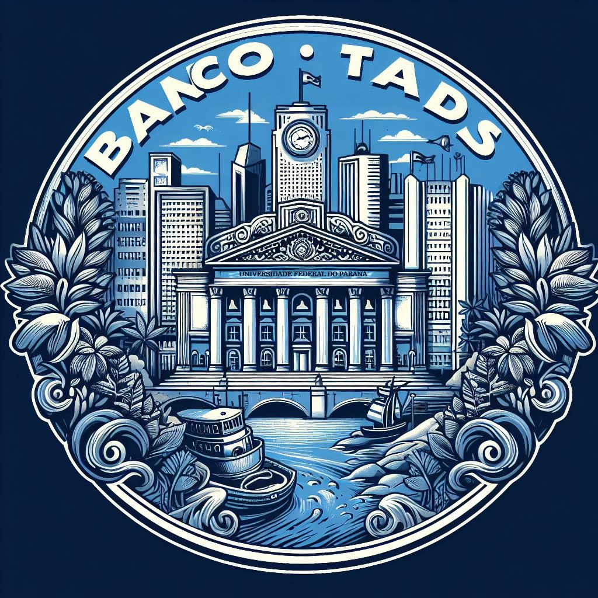

Tecnologia em Análise e Desenvolvimento de Sistemas

Setor de Educação Profissional e Tecnológica - SEPT

Universidade Federal do Paraná - UFPR

---

*DS131 - Linguagem de Programação Orientada a Objetos*

Prof. Rafael Romualdo Wandresen

# Trabalho Final LPOO UFPR 
Trabalho prático final de Linguagem de Programação Orientada a Objetos do curso de Análise de Desenvolvimento de Sistemas da UFPR

- [Alunos](#alunos)
- [Sistema](#sistema)
- [Documentação](#documentação)

## Alunos
<!-- contributors -->
<table>
	<tr>
       <td align="center">
            <a href="https://github.com/Salgado2004">
                
                
<strong>Salgado2004</strong>

            </a>
        </td>
       <td align="center">
            <a href="https://github.com/raulbana">
                
                
<strong>raulbana</strong>

            </a>
        </td>
       <td align="center">
            <a href="https://github.com/AlissonGSantos">
                
                
<strong>AlissonGSantos</strong>

            </a>
        </td>
       <td align="center">
            <a href="https://github.com/Pedro-H108">
                
                
<strong>Pedro-H108</strong>

            </a>
        </td>
	</tr>
</table>
Made with <a href='https://github.com/marketplace/actions/contributors-readme-chart-generator'>Contributors README Chart Generator</a>
<!-- /contributors -->

## Sistema
Desenvolvimento do sistema bancário do **`Banco TADS-UFPR`**

[Download latest release](https://github.com/Salgado2004/Trabalho-Final-LPOO-UFPR/releases/latest)

## Documentação

[Confira a documentação na nossa Wiki!](https://github.com/Salgado2004/Trabalho-Final-LPOO-UFPR/wiki)

</img>
### &copy; Tads UFPR 2024

