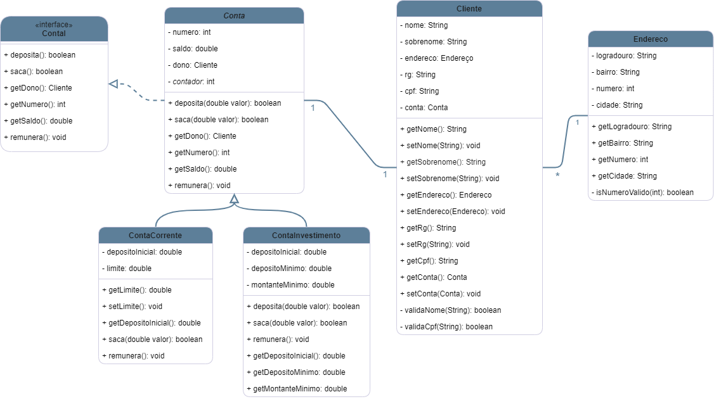

Tecnologia em Análise e Desenvolvimento de Sistemas

Setor de Educação Profissional e Tecnológica - SEPT

Universidade Federal do Paraná - UFPR

---

*DS131 - Linguagem de Programação Orientada a Objetos*

Prof. Rafael Romualdo Wandresen

# Trabalho Final LPOO UFPR 
Trabalho prático final de Linguagem de Programação Orientada a Objetos do curso de Análise de Desenvolvimento de Sistemas da UFPR

- [Alunos](#alunos)
- [Sistema](#sistema)
- [Documentação](#documentação)
  - [Javadoc](#javadoc)
  - [Diagrama de classes](#diagrama-de-classes)

## Alunos
- Alisson Gabriel Santos [@Alisson](https://github.com/AlissonGabrielSantos)
- Leonardo Felipe Salgado [@Salgado2004](https://github.com/Salgado2004)
- Pedro Henrique de Souza [@Pedro-H108](https://github.com/Pedro-H108)
- Raul Ferreira Costa Bana [@raulbana](https://github.com/raulbana)

## Sistema
Desenvolvimento do sistema bancário do **`Banco TADS-UFPR`**

[Download latest release](https://github.com/Salgado2004/Trabalho-Final-LPOO-UFPR/releases/latest)

</img>

## Documentação

### Javadoc
Veja [Documentação Javadoc](https://salgado2004.github.io/Trabalho-Final-LPOO-UFPR/)

### Diagrama de classes

